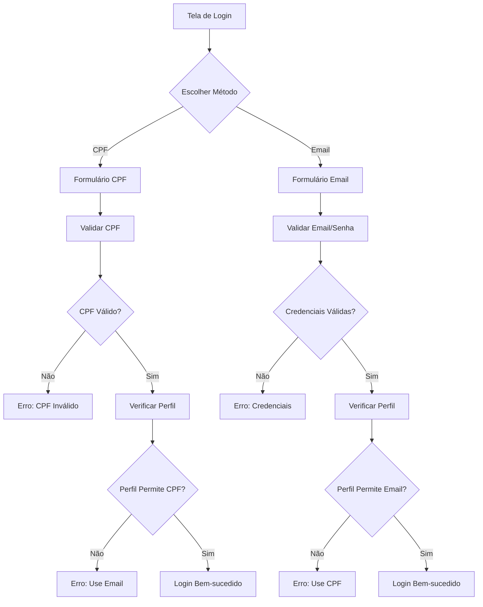

# Sistema de Autenticação Organizado - MIEADI

## Visão Geral

O sistema de autenticação do MIEADI foi reorganizado para separar os tipos de acesso por perfil de usuário, garantindo maior segurança e clareza.

## Tipos de Acesso

### 🆔 Acesso por CPF
**Perfis autorizados:**
- **Aluno** - Estudantes dos cursos
- **Membro** - Membros da congregação
- **Pastor** - Líderes espirituais

**Características:**
- Login simplificado apenas com CPF
- Validação de termos de uso obrigatória
- Configuração opcional de PIN de segurança
- Interface focada na usabilidade

### 📧 Acesso Administrativo (Email)
**Perfis autorizados:**
- **Diretor** - Gestão geral do sistema
- **Professor** - Docentes e instrutores
- **Coordenador** - Coordenação acadêmica
- **Secretário** - Secretaria administrativa

**Características:**
- Login com email e senha
- Autenticação via Supabase Auth
- Sessões mais seguras
- Funcionalidades administrativas completas

## Validações Implementadas

### Validação de Perfil por Método
O sistema verifica se o perfil pode usar o método de login escolhido:

- **Login por CPF**: Rejeita perfis administrativos (diretor, professor, coordenador, secretário)
- **Login por Email**: Rejeita perfis de usuário comum (aluno, membro, pastor)

### Mensagens de Erro Específicas
Quando um usuário tenta usar o método incorreto, recebe orientações claras:
- "Este perfil (professor) deve usar o login por email. Acesse através da opção 'Acesso Administrativo'."
- "Este perfil (aluno) deve usar o login por CPF. Acesse através da opção 'Acesso por CPF'."

## Interface de Login

### Tela de Seleção
- Apresenta duas opções claras de acesso
- Mostra quais perfis podem usar cada método
- Inclui informações visuais sobre os tipos de acesso

### Formulários Específicos
- **CPF**: Interface simplificada com validação de CPF em tempo real
- **Email**: Interface completa com campos de email e senha

## Segurança

### CPF Login
- Validação algorítmica do CPF
- Verificação de existência no banco de dados
- Estabelecimento de contexto para RLS (Row Level Security)
- Atualização de último login

### Email Login
- Autenticação via Supabase Auth
- Sessões gerenciadas automaticamente
- Políticas RLS baseadas em auth.uid()
- Logout seguro com limpeza de sessão

## Fluxo de Autenticação



## Configuração Técnica

### AuthService
- `canUseCPFLogin(role)`: Verifica se o perfil pode usar login por CPF
- `canUseEmailLogin(role)`: Verifica se o perfil pode usar login por email
- `signInWithCPF(cpf)`: Processa login por CPF
- `signInWithPassword(email, password)`: Processa login por email

### Perfis de Usuário
```typescript
export type UserType = "diretor" | "aluno" | "pastor" | "professor" | "coordenador" | "secretario" | "membro";

export const CPF_LOGIN_ROLES: UserType[] = ["aluno", "membro", "pastor"];
export const EMAIL_LOGIN_ROLES: UserType[] = ["diretor", "professor", "coordenador", "secretario"];
```

## Benefícios

1. **Clareza**: Usuários sabem exatamente como devem acessar
2. **Segurança**: Perfis administrativos usam autenticação mais robusta
3. **Usabilidade**: Login por CPF simplifica acesso para usuários comuns
4. **Manutenibilidade**: Separação clara de responsabilidades
5. **Escalabilidade**: Fácil adição de novos perfis e métodos

## Próximos Passos

- [ ] Implementar recuperação de senha para perfis administrativos
- [ ] Adicionar autenticação por biometria para dispositivos móveis
- [ ] Criar relatórios de acesso por tipo de perfil
- [ ] Implementar bloqueio automático após tentativas falharam